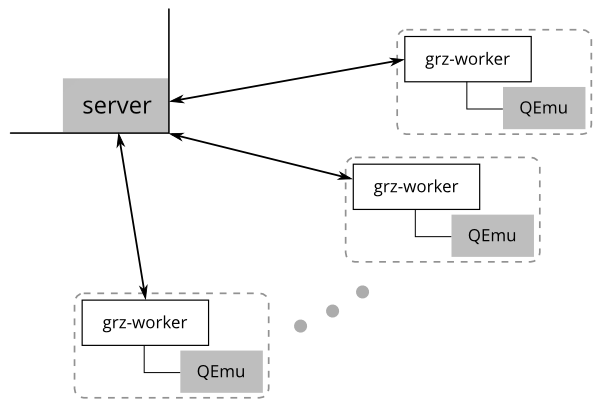

Garzón: a judge system
======================

Garzón is a "judge" system, an automatic problem corrector. You submit
solutions to problems and Garzón accepts or rejects them. It is
inspired by the way programming contests work. The system has three
parts: a load balancer (the 'server'), several workers, and a virtual
machine or VM that each worker controls:

There are separate directories for each part:

- ``grz-vm``: a script to manage VMs.

- ``grz-worker``: a binary that connects to the server and controls the
  VMs (a QEmu process).

- ``server``: a small library for the server process.

``grz-vm``
----------

This script assists in creating virtual machines. To reduce the
footprint of the VM, Tiny Core Linux is used. This allows the creation
of very small and quick virtual machines. The typical steps in
creating a virtual machine are::

   $ grz-vm download
   $ grz-vm remaster core.gz initrd.gz
   $ grz-vm createimg garzon.img
   $ grz-vm install garzon.img go gcc
   $ grz-vm convert garzon.img garzon.qcow2

The first step downloads the kernel and initrd image for Tiny Core
Linux. The "remaster" part introduces modifications to the initrd
specific to Garzón. Then a new disk image is created (garzon.img), some
software is installed within, and finally the disk image is converted 
to the qcow format, suitable for snapshotting with QEmu.

``grz-worker``
--------------

The worker first launches a non-graphical instance of QEmu, which will
look for the environment variable GARZON_VMS, and will by default use
``garzon.qcow2`` as image. This enables the use of different images for
different purposes. The options are::

    $ grz-worker -help
    Usage of grz-worker:
      -graphic=false: Show QEmu graphic mode
      -image="garzon.qcow2": Specify image file to use
      -prepare=false: Only create the snapshot

You can 1) see the QEmu console using ``-graphic=true``, 2) specify the image,
and 3) for the first run, do a ``-prepare``, which does a snapshot of the
clean state of the virtual machine.

``server``
----------

The server library has a very simple API. It only needs one call to::

     server.Handle()

during initialization. This will register an HTTP handler to accept
connections from workers.

When evaluating a submission, you just call::

    func Judge(submission Submission, report func(msg string)) (veredict string, err error)

This function will evaluate the submission using one of the available
workers, optionally notify progress by using the ``report`` callback,
and will return the ``veredict`` (or an ``error``).

``example-server``
------------------

There is an example server which implements a very simple web
application using websockets that lists problems and lets users
register and send problems (no DB).

